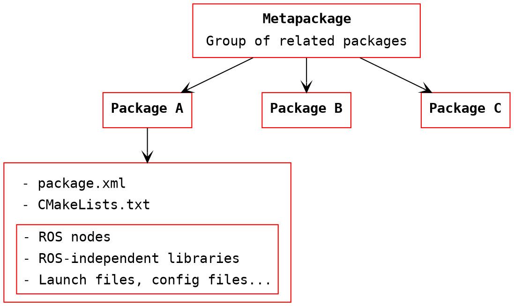
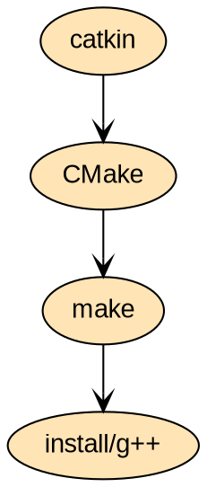
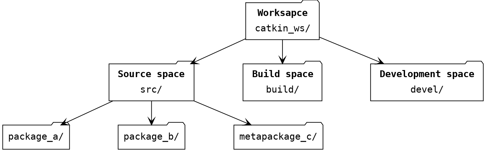

# 02. Linux, ROS alapismeretek

---

## Elmélet

---

### Linux principles

---

{:style="width:400px" align=right}

- Only OS supported by ROS
- Security
- Efficieny
- Open-source
- Community support
- User freedom
- Distributions: **Ubuntu**, Linux Mint, Debian, etc.
- Terminal usage more dominant

!!! tip "Suggestion"
    Install **Terminator** terminal emulator:
    ```bash
    sudo apt update
    sudo apt install terminator
    ```


---

### Linux commands

---

See some basic commands below:

- Run as administrator with `sudo`
- Manual of command `man`, e.g. `man cp`
- Package management `apt`, e.g. `apt update`, `apt install`
- Navigation `cd`
- List directory contents `ls`
- Copy file `cp`
- Move file `mv`
- Remove file `rm`
- Make directory `mkdir`
- Remove directory `rmdir`
- Make a file executable `chmod +x <filename>`
- Safe restart: Crtl + Alt + PrtScr + REISUB
- If not sure, just google the command


---

### ROS principles

---

#### ROS file system

----




!!! Abstract "ROS package principle"
    Enough functionality to be useful, but not too much that the package is heavyweight and difficult to use from other software.

---

#### ROS package

---

- Main unit to organize software in ROS
- Buildable and redistributable unit of ROS code
- Consosts of:
    - Manifest (package.xml): information about package
        - name
        - version
        - description
        - dependencies
        - etc.
    - CMakeLists.txt: *input for the CMake build system*
    - Anything else
- `rosrun turtlesim turtlesim_node`

---

#### ROS node

---


- Executable part of ROS:
    - python scripts
    - compiled C++ code
- A process that performs computation
- Inter-node communication:
    - ROS topics (streams)
    - ROS parameter server
    - Remote Procedure Calls (RPC)
    - ROS services
    - ROS actions
- Meant to operate at a fine-grained scale
- Typically, a robot control system consists of many nodes, like:
    - Trajectory planning
    - Localization
    - Read sensory data
    - Process sensory data
    - Motor control
    - User interface
    - etc.

---

#### ROS build system---Catkin

---

- System for building software packages in ROS



---

#### ROS workspace

---

!!! abstract "Catkin workspace"
    A folder where catkin packages are modified, built, and installed.




- Source space:
    - Source code of catkin packages
    - Space where you can extract/checkout/clone source code for the packages you want to build
- Build space
    - CMake is invoked here to build the catkin packages
    - CMake and catkin keep intermediate files here
- Devel space:
    - Built target are placed here prior to being installed

---

#### Environmental setup file

---

- setup.bash
- generated during init process of a new workspace
- extends shell environment
- ROS can find any resources that have been installed or built to that location

```bash
source ~/catkin_ws/devel/setup.bash
```

---

#### ROS master

---

```bash
roscore
```

- Registers:

    - Nodes
    - Topics
    - Services
    - Parameters
    
- One per system
- `roslaunch` launches ROS master automatically


---

## Gyakorlat

---

!!! warning "Figyelem!"
    Az óra végén a **forráskódokat** mindenkinek fel kell tölteni **Moodle**-re egy zip archívumba csomagolva!


---

### 1: Turtlesim

---


1. Indítsuk el a ROS mastert, `turtlesim_node`-ot és a `turtle_teleop_key` node-ot az alábbi parancsokkal, külö-külön terminál ablakokban:


    !!! tip
        **Terminator**-ban `Ctrl-Shift-O`, `Ctrl-Shift-E` billentyű kombinációkkal oszthatjuk tovább az adott ablakot. `Ctrl-Shift-W` bezárja az aktív ablakot.


    ```bash
    roscore
    rosrun turtlesim turtlesim_node
    rosrun turtlesim turtle_teleop_key
    ```

    !!! tip "Futtatás megszakítása"
        `Ctrl-C`


    ---

2. Az alábbi parancs segítségével jeleníttessük meg a futó rendszer node-jait és topic-jait:

    ```bash
    rosrun rqt_graph rqt_graph
    ```

    ---

3. Az alábbi ROS parancsok futtatása hasznos információkkal szolgálhat:

    ```bash
    roswtf
    rospack list
    rospack find turtlesim
    rosnode list
    rosnode info
    rosnode info /turtlesim
    rostopic list
    rostopic info /turtle1/cmd_vel
    rosmsg show geometry_msgs/Twist
    rostopic echo /turtle1/cmd_vel
    ```

    ---

4. Írjuk be a következő parancsot terminálba:

    ```bash
    rostopic pub /turtle1/cmd_vel geometry_msgs/Twist -r 1 -- '[2.0, 0.0, 0.0]' '[0.0, 0.0, 1.8]'
    ```

---

### 2: Catkin workspace

---


1. Telepítsük a catkin build tools csomagot:

    ```bash
    sudo apt update
    sudo apt-get install python3-catkin-tools python3-osrf-pycommon
    ```

    ---

2. Másoljuk az alábbi sort a `~/.bashrc` fájl végére:

    ```bash
    source /opt/ros/noetic/setup.bash   # replace noetic by whatever your ROS distribution is
    ```
    
    ---
        

3. Hozzuk létre a workspace-t:

    ```bash
    source /opt/ros/noetic/setup.bash 
    mkdir -p ~/catkin_ws/src
    cd ~/catkin_ws
    catkin init
    ```
    
---
           

### 3: ROS package létrehozása

1. Hozzunk létre új ROS package-et `ros_course` névvel.

    ```bash
    cd ~/catkin_ws/src
    catkin create pkg ros_course --catkin-deps std_msgs rospy roscpp
    ```

    !!! note "Szintaxis"
        `catkin create pkg <PKG_NAME> --catkin-deps <DEP_1> <DEP_2>`

    ---

2. Nyissuk meg a `package.xml` fájlt, és töltsük fel a következő tag-eket:

    ```xml
    <description>The beginner_tutorials package</description>

    <maintainer email="you@yourdomain.tld">Your Name</maintainer>
    ```

    ---

3. Build-eljük a workspace-t.

    ```bash
    cd ~/catkin_ws
    catkin build
    ```

    !!! danger
        **Soha** ne használjuk a `catkin build` és a `catkin_make` parancsokat ugyanabban a workspace-ben!

    ---

4. A `~/.bashrc` fájl végére illesszük be az alábbi sort:

    ```bash
    source ~/catkin_ws/devel/setup.bash
    ```

---

### 4: Publisher implementálása Python-ban

1. Hozzunk létre egy mappát `scripts` névvel a `ros_course` package-ben.

    ```bash
    cd ~catkin_ws/src/ros_course
    mkdir scripts
    cd scripts
    ```
    
    ---
    
2. Navigáljunk a `scripts` mappába és hozzuk létre a `talker.py` fájlt az alábbi tartalommal.

    ```python
    import rospy
    from std_msgs.msg import String

    def talker():
        rospy.init_node('talker', anonymous=True)
        pub = rospy.Publisher('chatter', String, queue_size=10)
        
        rate = rospy.Rate(10) # 10hz
        
        while not rospy.is_shutdown():
            hello_str = "hello world %s" % rospy.get_time()
            print(hello_str)
            pub.publish(hello_str)
            rate.sleep()


    if __name__ == '__main__':
        try:
            talker()
        except rospy.ROSInterruptException:
            pass
    ```


    ---
    
    
3. A `CMakeLists.txt`-hez adjuk hozzá a következőt:

    ```cmake
    catkin_install_python(PROGRAMS scripts/talker.py
        DESTINATION ${CATKIN_PACKAGE_BIN_DESTINATION}
    )
    ```
    
    ---
        
        

4. Build-eljük és futtassuk a node-ot:

    ```bash
    cd ~/catkin_ws
    catkin build
    rosrun ros_course talker.py
    ```

    !!! tip
        A node futtatásához szükség van a ROS masterre. Egy külön terminál ablakban indítsuk el a `roscore` paranccsal.


    ---
    
5. Ellenőrizzük le a node kimenetét a `rostopic echo` parancs használatával.

---

### 5: Subscriber implementálása Python-ban

1. Navigáljunk a `scripts` mappába és hozzuk létre a `listener.py` fájlt az alábbi tartalommal.

    ```python
    import rospy
    from std_msgs.msg import String

    def callback(data):
        print(rospy.get_caller_id() + "I heard %s", data.data)
    
    def listener():

        # In ROS, nodes are uniquely named. If two nodes with the same
        # name are launched, the previous one is kicked off. The
        # anonymous=True flag means that rospy will choose a unique
        # name for our 'listener' node so that multiple listeners can
        # run simultaneously.
        rospy.init_node('listener', anonymous=True)
    
        rospy.Subscriber("chatter", String, callback)

        # spin() simply keeps python from exiting until this node is stopped
        rospy.spin()


    if __name__ == '__main__':
        listener()
    ```

    ---
    
    
2. A `CMakeLists.txt`-hez adjuk hozzá a következőt:

    ```cmake
    catkin_install_python(PROGRAMS scripts/talker.py scripts/listener.py
        DESTINATION ${CATKIN_PACKAGE_BIN_DESTINATION}
    )
    ```

    ---
    
3. Build-eljük és futtassuk mind a 2 node-ot:

    ```bash
    cd ~/catkin_ws
    catkin build
    rosrun ros_course talker.py
    ```
    
    ```bash
    rosrun ros_course listener.py
    ```
    
    ---

4. `rqt_graph` használatával jeleníttessük meg a futó rendszer node-jait és topic-jait:

    ```bash
    rosrun rqt_graph rqt_graph
    ```


!!! warning "Figyelem!"
    Az óra végén a forráskódokat mindenkinek fel kell tölteni Moodle-re egy zip archívumba csomagolva!


---


## Hasznos linkek

- [ROS Tutorials](http://wiki.ros.org/ROS/Tutorials)
- [Curiosity rover simulation](https://www.tapatalk.com/groups/jpl_opensource_rover/real-curiosity-rover-simulation-in-gazebo-with-ros-t60.html)


