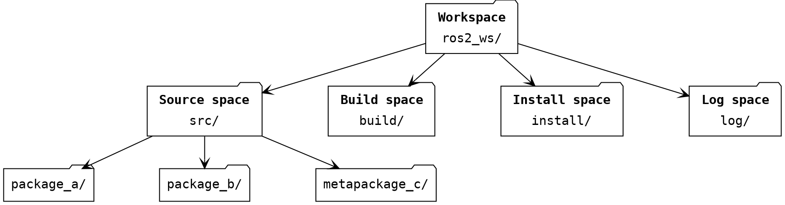
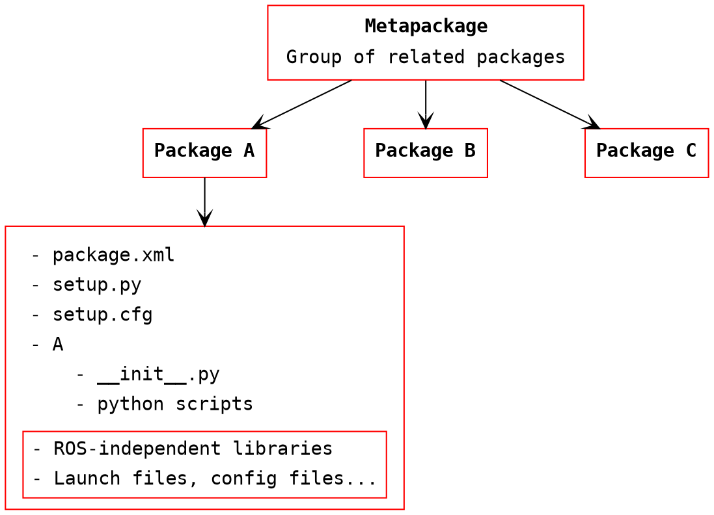
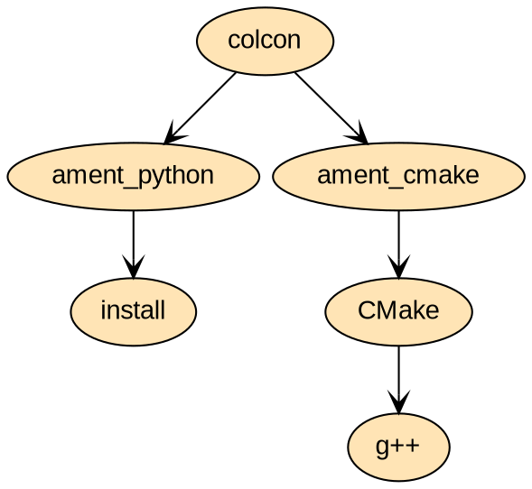
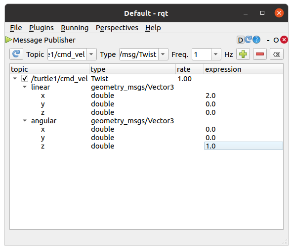

# 02. Linux, ROS alapismeretek

---

## Elmélet


---

### ROS 1 &rarr; ROS 2

---


- ROS 2 was rewritten from scratch
- More modular architecture
- Improved support for real-time systems
- Support for multiple communication protocols
- Better interoperability with other robotic systems
- Focus on standardization and industry collaboration
- No ROS Master
- No Devel space
- `rclpy`, `rclcpp`
- More structured code (`Node` class)
- Different build system
- Platforms: Windows, OS X, Linux

---

### ROS principles

---

---

#### ROS node

---

{:style="width:600px" align=right}

- Executable part of ROS:
    - python scripts
    - compiled C++ code
- A process that performs computation
- Inter-node communication:
    - ROS topics (streams)
    - ROS parameter server
    - Remote Procedure Calls (RPC)
    - ROS services
    - ROS actions
- Meant to operate at a fine-grained scale
- Typically, a robot control system consists of many nodes, like:
    - Trajectory planning
    - Localization
    - Read sensory data
    - Process sensory data
    - Motor control
    - User interface
    - etc.

---

#### ROS workspace

---

!!! abstract "Colcon workspace"
    A folder where packages are modified, built, and installed.




- Source space:
    - Source code of colcon packages
    - Space where you can extract/checkout/clone source code for the packages you want to build
- Build space
    - Colcon is invoked here to build packages
    - Colcon and CMake keep intermediate files here
- Install space:
    - Each package will be installed here; by default each package will be installed into a separate subdirectory
- Log space:
    - Contains various logging information about each colcon invocation

---


!!! Abstract "ROS package principle"
    Enough functionality to be useful, but not too much that the package is heavyweight and difficult to use from other software.

!!! Tip "ROS dependencies"
    After cloning a new package, use the following command to install depenencies:
    ```bash
    rosdep install --from-paths src --ignore-src -r -y
    ```

---

#### ROS package

---

- Main unit to organize software in ROS
- Buildable and redistributable unit of ROS code
- Consists of (in the case of Python packages):
    - `package.xml` file containing meta information about the package
        - name
        - version
        - description
        - dependencies
        - etc.
    - `setup.py` containing instructions for how to install the package
    - `setup.cfg` is required when a package has executables, so ros2 run can find them 
    - `/<package_name>` - a directory with the same name as your package, used by ROS 2 tools to find your package, contains `__init__.py`
    - Anything else
- `ros2 run turtlesim turtlesim_node`

!!! note "CMake"
    For CMake packages (C++), the package contents will be different.





---

#### ROS build system---Colcon

---

- System for building software packages in ROS




---


### Linux principles

---

{:style="width:400px" align=right}

- (Was) the only OS supported by ROS
- Security
- Efficieny
- Open-source
- Community support
- User freedom
- Distributions: **Ubuntu**, Linux Mint, Debian, etc.
- Terminal usage more dominant

!!! tip "Suggestion"
Install **Terminator** terminal emulator:
```bash
sudo apt update
sudo apt install terminator
```


---

### Linux commands

---

See some basic commands below:

- Run as administrator with `sudo`
- Manual of command `man`, e.g. `man cp`
- Package management `apt`, e.g. `apt update`, `apt install`
- Navigation `cd`
- List directory contents `ls`
- Create file `touch`
- Copy file `cp`
- Move file `mv`
- Remove file `rm`
- Make directory `mkdir`
- Remove directory `rmdir`
- Make a file executable `chmod +x <filename>`
- Safe restart: Crtl + Alt + PrtScr + REISUB
- If not sure, just google the command


---


#### Environmental setup file

---

- setup.bash
- generated during init process of a new workspace
- extends shell environment
- ROS can find any resources that have been installed or built to that location

```bash
source ~/ros2_ws/install/setup.bash
```


---

## Gyakorlat

---

### 1: Linux gyakorlás

---

1. Hozzunk létre egy új mappát a home könyvtárban a 
`mkdir` parancs segítségével.

    ```bash
    mkdir ~/test_folder
    ```

    ---

2. Navigáljunk a létrehozott mappába a `cd` parancs használatával.

    ```bash
    cd ~/test_folder
    ```

    ---

3. Hozzunk létre egy új Python fájlt a `touch` parancs segítségével,
nevezzük el "hello.py"-nek.

    ```bash
    touch hello.py
    ```

    ---

4. Nyissuk meg a "hello.py" fájlt a Gedit szövegszerkesztővel, használjuk a `gedit` 
parancsot.

    ```bash
    gedit hello.py
    ```

    ---

5. Írjunk egy egyszerű Python programot a "hello.py" fájlba, például:

    ```python
    #!/usr/bin/python3
    print("Hello, World!")
    ```

    ---

6. Mentés után készítsünk másolatot a "hello.py" fájlból egy másik néven (pl.: "hello_copy.py") a `cp` parancs segítségével.

    ```bash
    cp hello.py hello_copy.py
    ```

    ---

7. Ellenőrizzük, hogy a másolat elkészült-e az `ls` parancs használatával.

    ```bash
    ls
    ```

    ---

8. Futtassuk a "hello.py" fájlt a `python3` előtaggal.

    ```bash
    python3 hello.py
    ```

    ---

9. Készítsünk egy shell szkriptfájlt, majd nyissuk is meg a Gedit segítségével.
Nevezzük el "myscript.sh"-nek.

   
    ```bash
    gedit myscript.sh
    ```

    ---

10. Írjunk egy egyszerű shell szkriptet a `myscript.sh` fájlba, például:

    ```bash
    #!/bin/bash
    echo "I make another copy of hello.py!"
    cp hello.py another_hello_copy.py
    ```

    ---

11. Adjunk futtatási jogosultságot a `myscript.sh` fájlnak a `chmod` parancs segítségével.

    ```bash
    chmod +x myscript.sh
    ```

    ---

12. Futtassuk a `myscript.sh` fájlt a `./` előtaggal.

    ```bash
    ./myscript.sh
    ```

    ---

13. Ellenőrizzük, hogy az újabb másolat elkészült-e az `ls` parancs használatával.

    ```bash
    ls
    ```

---

### 2: Turtlesim

---


1. Indítsuk el a `turtlesim_node`-ot és a `turtle_teleop_key` node-ot az alábbi parancsokkal, külö-külön terminál ablakokban:


    ```bash
    ros2 run turtlesim turtlesim_node
    ```

    ```bash
    ros2 run turtlesim turtle_teleop_key
    ```

    !!! tip
        **Terminator**-ban `Ctrl-Shift-O`, `Ctrl-Shift-E` billentyű kombinációkkal oszthatjuk tovább az adott ablakot. `Ctrl-Shift-W` bezárja az aktív ablakot.


    !!! tip "Futtatás megszakítása"
        `Ctrl-C`


    ---

2. Az alábbi ROS parancsok futtatása hasznos információkkal szolgálhat:

    ```bash
    ros2 wtf
    ros2 node list
    ros2 node info /turtlesim
    ros2 topic list
    ros2 topic info /turtle1/cmd_vel
    ros2 interface show geometry_msgs/msg/Twist
    ros2 topic echo /turtle1/cmd_vel
    ```

    ---

3. Az alábbi paranccsal indítsuk el az `rqt_gui`-t:

    ```bash
    ros2 run rqt_gui rqt_gui
    ```

    ---

4. Jelenítsük meg a futó node-okat és topic-okat `rqt_gui`-ban: Plugins &rarr; Introspection &rarr; Node Graph.

    ---

5. Publikáljunk a `/turtle1/cmd_vel` topic-ba szintén az `rqt_gui` felhasználásával: Plugins &rarr; Topics &rarr; Message Publisher.
   
    {:style="width:500px"}


---

### 3: ROS 2 workspace létrehozása

---

1. Hozzunk létre új ROS2 workspace-t `ros2_ws` névvel.

    ```bash
    mkdir -p ~/ros2_ws/src
    ```

---           

### 4: ROS 2 package létrehozása

---

1. Hozzunk létre új ROS2 package-et `ros2_course` névvel és egy Hello World-del.

    ```bash
    cd ~/ros2_ws/src
    ros2 pkg create --build-type ament_python --node-name hello ros2_course
    ```

    !!! note "Szintaxis"
        `ros2 pkg create --build-type ament_python <package_name>`

    ---

3. Build-eljük a workspace-t.

    ```bash
    cd ~/ros2_ws
    colcon build --symlink-install
    ```

    !!! note "Symlink"
        A `--symlink-install` opció az Install space-be belinkeli a forrás script-eket, így módosítás után nem kell újra build-elnünk.  

   
    ---

4. A `~/.bashrc` fájl végére illesszük be az alábbi sort:

    ```bash
    source ~/ros2_ws/install/setup.bash
    ```

    !!! note "Importálás QtCreator-ba"
        New file or project &rarr; Other project &rarr; ROS Workspace. Válasszuk ki a Colcon-t, mint Build System, és a `ros2_ws`-t, mint Worksapce path.

    !!! note "Importálás CLion-ba"
        Állítsuk be a Python interpretert Python 3.10-re, `/usr/bin/python3.10`. Adjuk hozzá akövetkező elérési utat: `/opt/ros/humble/lib/python3.10/site-packages`. Hozzuk létre a `compile_commands.json` fájlt a `~/ros2_ws/build` könyvtárban az alábbi tartalommal:
        ```bash
        [
        ]
        ```

    ---

5. Teszteljük a Hello World működését:

    ```bash
    ros2 run ros2_course hello 
    ```
   
---   
    
### 5: Publisher implementálása Python-ban

---

    
1. Navigáljunk a `ros2_ws/src/ros2_course/ros2_course` mappába és hozzuk létre a `talker.py` fájlt az alábbi tartalommal.

    ```python
    import rclpy
    from rclpy.node import Node
    
    from std_msgs.msg import String
    
    
    class MinimalPublisher(Node):
    
        def __init__(self):
            super().__init__('minimal_publisher')
            self.publisher_ = self.create_publisher(String, 'chatter', 10)
            timer_period = 0.5  # seconds
            self.timer = self.create_timer(timer_period, self.timer_callback)
            self.i = 0
    
        def timer_callback(self):
            msg = String()
            msg.data = 'Hello World: %d' % self.i
            self.publisher_.publish(msg)
            self.get_logger().info('Publishing: "%s"' % msg.data)
            self.i += 1
    
    
    def main(args=None):
        rclpy.init(args=args)
        minimal_publisher = MinimalPublisher()
        rclpy.spin(minimal_publisher)
    
        # Destroy the node explicitly
        # (optional - otherwise it will be done automatically
        # when the garbage collector destroys the node object)
        minimal_publisher.destroy_node()
        rclpy.shutdown()
    
    
    if __name__ == '__main__':
        main()
    ```


    ---
    
    
3. A `setup.py` fájlban adjunk meg egy új entry point-on:

    ```python
    'talker = ros2_course.talker:main',
    ```
    
    ---
        
        

4. Build-eljük és futtassuk a node-ot:

    ```bash
    cd ~/ros2_ws
    colcon build --symlink-install
    ros2 run ros2_course talker
    ```

    
    ---
    
5. Ellenőrizzük le a node kimenetét a `ros2 topic echo` parancs vagy az `rqt_gui` használatával.

---

### 6: Subscriber implementálása Python-ban

---

1. Navigáljunk a `ros2_ws/src/ros2_course/ros2_course` mappába és hozzuk létre a `listener.py` fájlt az alábbi tartalommal.

    ```python
    import rclpy
    from rclpy.node import Node
    from std_msgs.msg import String


    class MinimalSubscriber(Node):

        def __init__(self):
            super().__init__('minimal_subscriber')
            self.subscription = self.create_subscription(
                String,
                'chatter',
                self.listener_callback,
                10)
            self.subscription  # prevent unused variable warning

        def listener_callback(self, msg):
            self.get_logger().info('I heard msg: "%s"' % msg.data)


    def main(args=None):
        rclpy.init(args=args)
        minimal_subscriber = MinimalSubscriber()
        rclpy.spin(minimal_subscriber)

        # Destroy the node explicitly
        # (optional - otherwise it will be done automatically
        # when the garbage collector destroys the node object)
        minimal_subscriber.destroy_node()
        rclpy.shutdown()

    if __name__ == '__main__':
        main()
    ```

    ---
    
    
2. A `setup.py` fájlban adjunk meg egy új entry point-on:

    ```python
    'listener = ros2_course.listener:main',
    ```

    ---
    
3. Build-eljük és futtassuk mind a 2 node-ot:

    ```bash
    cd ~/ros2_ws
    colcon build --symlink-install
    ros2 run ros2_course talker
    ```
    
    ```bash
    ros2 run ros2_course listener
    ```
    
    ---

4. Az `rqt_gui` használatával jeleníttessük meg a futó rendszer node-jait és topic-jait:

    ```bash
    ros2 run rqt_gui rqt_gui
    ```

---


## Hasznos linkek

- [ROS 2 Tutorials](https://docs.ros.org/en/humble/Tutorials.html)
- [What is a ROS 2 package?](https://docs.ros.org/en/eloquent/Tutorials/Creating-Your-First-ROS2-Package.html#what-is-a-ros-2-package)


