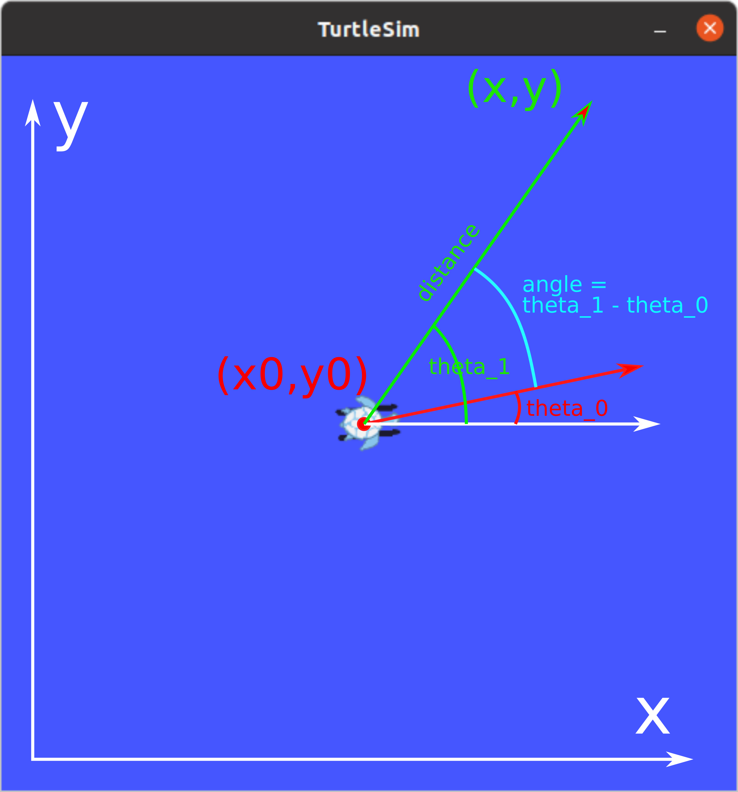

# 03. Python alapismeretek, ROS Publisher, ROS Subscriber


---

## Elmélet

--- 


### Python principles


{:style="width:400px" align=right}

- Interpreted, high-level programming language
- Name tribute to the comedy group *Monty Python*
- Powerful, still easy to learn, easy to use
- Readability
- **Whitespace indentation**

{:style="width:350px" align=right}

- Dynamically-typed
- Garbage colector and reference counting
- Object oriented programming
- Used in: AI, web applications, scientific computing, and many other areas
- `python3`
                                     
---

### Python syntax

```python
import numpy as np
import math

class A:
    def __init__(self, name):
        self.name = name

    def do_something(self):
        # will do something
        print(self.name + " is doing something.")

    def count_to(self, n):
        # count to n, tell if the number is odd or even
        for i in range(n):
            if i % 2 == 0:
                print(i + ", it's even.")
            else:
                print(i + ", it's odd.")
        
  

if __name__ == "__main__":
    a = A("John")
    a.do_something()
    a.count_to(10)
```

## Gyakorlat


---

    
### 1: Teknőc mozgatása egyenes mentén


1. Írjunk ROS node-ot, amely előre, egyenes mentén megadott távolságra mozgatja a teknőcöt.
Nyissunk meg egy terminált. Huzzuk létre a `~/ros2_ws/src/ros2_course/ros2_course`
könyvtárunkban a `turtlesim_controller.py` fájlt:

    {:style="width:300px" align=right} 

    ```bash
    cd ros2_ws/src/ros2_course/ros2_course
    touch turtlesim_controller.py
    ```

   
    ---

2. A `setup.py` fájlban adjunk meg egy új entry point-on:

    ```python
    'turtlesim_controller = ros2_course.turtlesim_controller:main',
    ```
    
    ---


    
3. Másoljuk be a `turtlesim_controller.py`-ba a program vázát:
    
    ```python
    import math
    import rclpy
    from rclpy.node import Node
   
   
    class TurtlesimController(Node):
   
        def __init__(self):
            super().__init__('turtlesim_controller')
   
   
        def go_straight(self, speed, distance):
            # Implement straght motion here
   
   
    def main(args=None):
        rclpy.init(args=args)
        tc = TurtlesimController()
   
        # Destroy the node explicitly
        # (optional - otherwise it will be done automatically
        # when the garbage collector destroys the node object)
        tc.destroy_node()
        rclpy.shutdown()
   
    if __name__ == '__main__':
        main()
    ```
    
    ---

4. Indítsunk egy egy `turtlesim_node`-ot, majd vizsgáljuk meg a topic-ot,
amellyel irányíthatjuk. Két külön terminálablakban:
    
    ```bash
    ros2 run turtlesim turtlesim_node
    ```
    
    ```bash
    ros2 topic list
    ros2 topic info /turtle1/cmd_vel
    ros2 interface show geometry_msgs/msg/Twist
    ```
   
    Vagy használjuk az `rqt_gui`-t:

    ```bash
    ros2 run rqt_gui rqt_gui
    ```

    ---
    
5. Importáljuk a `geometry_msgs/msg/Twist` üzenettípust és hozzuk létre a publishert a
`turtlesim_controller.py`-ban:

    ```python
    from geometry_msgs.msg import Twist
    
    #...
    
    # In the constructor:
    self.twist_pub = self.create_publisher(Twist, '/turtle1/cmd_vel', 10)
    ```

    ---
 

    
6. Implementáljuk a `go_straight` metódust. Számítsuk ki, mennyi ideig tart,
hogy a megadott távolságot a megadott sebességgel megtegye a teknőc. Publikáljunk üzenetet,
amivel beállítjuk a sebességet, majd várjunk a kiszámított ideig, ezután
küldjünk újabb üzenetet, amellyel nullázzuk a sebességet.
Egy kis segítség az API használatához:

   
    ```python
    # Create and publish msg
    vel_msg = Twist()
    if distance > 0:
        vel_msg.linear.x = speed
    else:
        vel_msg.linear.x = -speed
    vel_msg.linear.y = 0.0
    vel_msg.linear.z = 0.0
    vel_msg.angular.x = 0.0
    vel_msg.angular.y = 0.0
    vel_msg.angular.z = 0.0

    # Set loop rate
    loop_rate = self.create_rate(100, self.get_clock()) # Hz

    # Calculate time
    # T = ...
   
    # Publish first msg and note time when to stop
    self.twist_pub.publish(vel_msg)
    # self.get_logger().info('Turtle started.')
    when = self.get_clock().now() + rclpy.time.Duration(seconds=T)

    # Publish msg while the calculated time is up
    while (some condition... and rclpy.ok()):
        self.twist_pub.publish(vel_msg)
        # self.get_logger().info('On its way...')
        rclpy.spin_once(self)   # loop rate

    # turtle arrived, set velocity to 0
    vel_msg.linear.x = 0.0
    self.twist_pub.publish(vel_msg)
    # self.get_logger().info('Arrived to destination.')
    ```
    
    ---
    
    
7. Build-eljük és futtassuk a node-ot:

    ```bash
    cd ros2_ws
    colcon build --symlink-install
    ros2 run ros2_course turtlesim_controller
    ```
    
    ---
    
   
### 2: Alakzatok rajolása

{:style="width:300px" align=right} 

1. Implementáljunk adott szöggel történő elfordulást megvalósító metódust a
`turtlesim_controller.py`-ban, az egyenes mozgásshoz hasonló módon.


    ```python
    def turn(self, omega, angle):
            # Implement rotation here
    ```
    
    ---
    
2. Implementáljunk a teknőccel négyzetet rajzoltató metódust az egyenes mozgást
és a fordulást végrehajtó metódusok felhasználásával.

    ```python
    def draw_square(self, speed, omega, a):
    ```
  
    ---
    
3. Implementáljunk a teknőccel tetszőleges szabályos alakzatot rajzoltató metódust
az egyenes mozgást és a fordulást végrehajtó metódusok felhasználásával.

    ```python
    def draw_poly(self, speed, omega, N, a):
    ```
 
    ---
    
   
### 3: Go to funkció implementálása

{:style="width:300px" align=right} 

1. Vizsgáljuk meg a topic-ot, amelyen a `turtlesim_node` a pillanatnyi pozícióját publikálja. 


    ```bash
    ros2 topic list
    ros2 topic info /turtle1/pose
    ros2 interface show turtlesim/msg/Pose
    ```


    Vagy használjuk az `rqt_gui`-t:  


    ```bash
    ros2 run rqt_gui rqt_gui
    ```
    
    --- 
 
2. Definiáljunk subscriber-t a topichoz és írjuk meg a callback függvényt.

    ```python
    # Imports
    from turtlesim.msg import Pose
 
        # Constructor
        self.pose = None
        self.subscription = self.create_subscription(
            Pose,
            '/turtle1/pose',
            self.cb_pose,
            10)
    
        # New method for TurtlesimController
        def cb_pose(self, msg):
            self.pose = msg  
    ```
    
    ---
    
    
3. Implementáljuk a `go_to` metódust. Teszteljük, hívjuk meg a main-ből.

    ```python
    # ...

    # Go to method
        def go_to(self, speed, omega, x, y):
            # Wait for position to be received
            loop_rate = self.create_rate(100, self.get_clock()) # Hz
            while self.pose is None and rclpy.ok():
                self.get_logger().info('Waiting for pose...')
                rclpy.spin_once(self)
            
            # Stuff with atan2
    
   
    # Main
    def main(args=None):
        rclpy.init(args=args)
        tc = TurtlesimController()
    
        tc.go_to(1.0, 20.0, 2, 8)
        tc.go_to(1.0, 20.0, 2, 2)
        tc.go_to(1.0, 20.0, 3, 4)
        tc.go_to(1.0, 20.0, 6, 2)
    
        # Destroy the node explicitly
        # (optional - otherwise it will be done automatically
        # when the garbage collector destroys the node object)
        tc.destroy_node()
        rclpy.shutdown()  
    ```

    {:style="width:600px"}

---
    
### Bónusz: Advanced go to
    
Írjunk arányos szabályozót használó go to funckiót.
    
    
---

## Hasznos linkek


- [For loops in python](https://www.w3schools.com/python/python_for_loops.asp)
- [Some python functions](https://docs.python.org/3.4/library/functions.html)
- [Turtlesim help](https://docs.ros.org/en/humble/Tutorials/Beginner-CLI-Tools/Introducing-Turtlesim/Introducing-Turtlesim.html)
- [atan2](https://en.wikipedia.org/wiki/Atan2)


