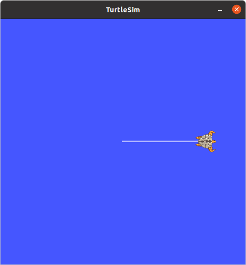
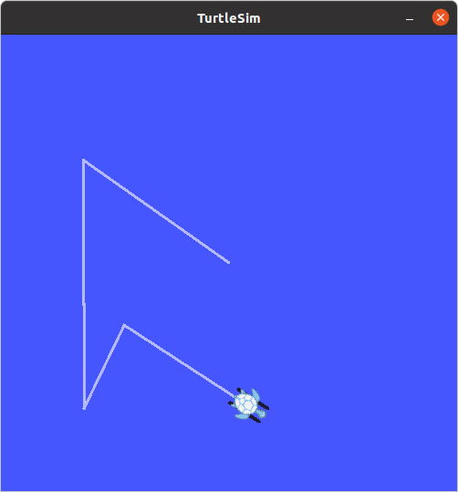

# 03. Python alapismeretek,  ROS kommunikáció gyakorlása

---

## Elmélet

--- 


### Python principles


{:style="width:400px" align=right}

- Interpreted, high-level programming language
- Name tribute to the comedy group *Monty Python*
- Powerful, still easy to learn, easy to use
- Readability
- **Whitespace indentation**

{:style="width:350px" align=right}

- Dynamically-typed
- Garbage colector and reference counting
- Object oriented programming
- Used in: AI, web applications, scientific computing, and many other areas
- `python3`
                                     
---

### Python syntax

```python
import numpy as np
import math

class A:
    def __init__(self, name):
        self.name = name

    def do_something(self):
        # will do something
        print(self.name + " is doing something.")

    def count_to(self, n):
        # count to n, tell if the number is odd or even
        for i in range(n):
            if i % 2 == 0:
                print(i + ", it's even.")
            else:
                print(i + ", it's odd.")
        
  

if __name__ == "__main__":
    a = A("John")
    a.do_something()
    a.count_to(10)
```

## Gyakorlat


---

### 1: Hello, World!

1. Nyissunk meg egy terminált. Huzzuk létre a *~/catkin_ws/src/ros_course/scripts/* könyvtárunkban a `hello.py` fájlt:

    ```bash
    cd catkin_ws/src/ros_course/scripts
    touch hello.py
    ```

2. Nyissuk meg a `hello.py` fájlt QtCreatorban, írjuk be a következő sort a `hello.py` fájlba:

    ```python
    print("Hello, World!")
    ```

    !!! tip
        **Aki gedit-et használ:** Preferences :arrow_forward: Editor :arrow_forward: Insert spaces instead of tabs.


3. Futtassuk a fájlt, terminál:

    ```bash
    python3 hello.py
    ```

4. Módosítsuk a programot úgy, hogy a *"World"* szót a parancssori argumentumként megadott szóval helyettesítse:

    ```python
    import sys

    msg = sys.argv[1]
    print("Hello," , msg, "!")
    ```

6. Futtassuk a fájlt, terminál:

    ```bash
    python3 hello.py John
    ``` 

### 2: Teknőc mozgatása egyenes mentén


1. Írjunk ROS node-ot, amely előre, egyenes mentén megadott távolságra mozgatja a teknőcöt. Nyissunk meg egy terminált. Huzzuk létre a *~/catkin_ws/src/ros_course/scripts* könyvtárunkban a `turtlesim_controller.py` fájlt:

    {:style="width:300px" align=right} 

    ```bash
    cd catkin_ws/src/ros_course/scripts
    touch turtlesim_controller.py
    ```

   
    ---
    
2. A `CMakeLists.txt`-hez adjuk hozzá a `turtlesim_controller.py`-t:

    ```cmake
    catkin_install_python(PROGRAMS 
        scripts/talker.py
        scripts/listener.py
        scripts/turtlesim_controller.py
        DESTINATION ${CATKIN_PACKAGE_BIN_DESTINATION}
    )
    ```
    
    ---
    
3. Másoljuk be a `turtlesim_controller.py`-ba a program vázát:
    
    ```python
    import rospy
    import math

    class TurtlesimController:
        def __init__(self):
            # Call init node only once
            rospy.init_node('turtlesim_controller', anonymous=True)
            # Define publisher here


        def go_straight(self, speed, distance, forward):
            # Implement straght motion here


    if __name__ == '__main__':
        # Init
        tc = TurtlesimController()
        # Send turtle on a straight line
        tc.go_straight(1, 4, True)
    ```
    
    ---

4. Indítsunk egy egy `turtlesim_node`-ot, majd vizsgáljuk meg a topic-ot, amellyel irányíthatjuk. Három külön terminálablakban:

    ```bash
    roscore
    ```
    
    ```bash
    rosrun turtlesim turtlesim_node
    ```
    
    ```bash
    rostopic list
    rostopic info /turtle1/cmd_vel
    rosmsg show geometry_msgs/Twist
    ```

    ---
    
5. Importáljuk a `geometry_msgs/Twist` üzenettípust és hozzuk létre a publishert a `turtlesim_controller.py`-ban:

    ```python
    from geometry_msgs.msg import Twist
    
    #...
    
    self.twist_pub = rospy.Publisher('/turtle1/cmd_vel', Twist, queue_size=10)
    
    ```

    ---
 

    
6. Implementáljuk a `go_straight` metódust. Számítsuk ki, mennyi ideig tart, hogy a megadott távolságot a megadott sebességgel megtegye a teknőc. Publikáljunk üzenetet, amivel beállítjuk a sebességet, majd várjunk a kiszámított ideig, ezután küldjünk újabb üzenetet, amellyel nullázzuk a sebességet. Egy kis segítség az API használatához:


    

    ```python
    # Create and publish msg
    vel_msg = Twist()
    if forward:
        vel_msg.linear.x = speed
    else:
        vel_msg.linear.x = -speed
    vel_msg.linear.y = 0
    vel_msg.linear.z = 0
    vel_msg.angular.x = 0
    vel_msg.angular.y = 0
    vel_msg.angular.z = 0
    
    # Set loop rate
    rate = rospy.Rate(100) # Hz
    
    # Publish first msg and note time
    self.twist_pub.publish(vel_msg)
    t0 = rospy.Time.now().to_sec()

    # Publish msg while the calculated time is up
    while (some condition...) and not(rospy.is_shutdown()):
        self.twist_pub.publish(vel_msg)
        # ...and stuff
        rate.sleep()    # loop rate
    
    
    # Set velocity to 0
    vel_msg.linear.x = 0
    self.twist_pub.publish(vel_msg)
    ```
    
    ---
    
   
### 3: Alakzatok rajolása

{:style="width:300px" align=right} 

1. Implementáljunk adott szöggel történő elfordulást megvalósító metódust a  `turtlesim_controller.py`-ban, az egyenes mozgásshoz hasonló módon.


    ```python
    def turn(self, omega, angle, forward):
            # Implement rotation here
    ```
    
    ---
    
2. Implementáljunk a teknőccel négyzetet rajzoltató metódust az egyenes mozgást és a fordulást végrehajtó metódusok felhasználásával.

    ```python
    def draw_square(self, speed, omega, a):
    ```
  
    ---
    
4. Implementáljunk a teknőccel tetszőleges szabályos alakzatot rajzoltató metódust az egyenes mozgást és a fordulást végrehajtó metódusok felhasználásával.

    ```python
    def draw_poly(self, speed, omega, N, a):
    ```
 
    ---
    
   
### 4: Go to funkció implementálása

{:style="width:300px" align=right} 

1. Vizsgáljuk meg a topic-ot, amelyen a `turtlesim_node` a pillanatnyi pozícióját publikálja. 


    ```bash
    rostopic list
    rostopic info /turtle1/pose
    rosmsg show turtlesim/Pose
    ```
    
    --- 
 
2. Definiáljunk subscriber-t a topichoz és írjuk meg a callback függvényt, majd implementáljuk a go to funkciót.

    ```python
    # Imports
    from turtlesim.msg import Pose
 
        # Constructor
        self.pose_subscriber = rospy.Subscriber('/turtle1/pose', Pose, self.cb_pose)
    
        # New method for TurtlesimController
        def cb_pose(msg):
            self.pose = msg
    
        # Go to method
        def go_to(self, speed, omega, x, y):
            # Stuff
        
        # Main
        if __name__ == '__main__':
            # Init
            tc = TurtlesimController()
            # 1 sec sleep so subscriber can get msgs
            rospy.sleep(1)  
            tc.go_to(1, 2, 2, 8)
        tc.go_to(1, 2, 2, 2)
        tc.go_to(1, 2, 3, 4)
        tc.go_to(1, 2, 6, 2)    
    ```
    
    
### Bónusz: Advanced go to
    
Írjunk arányos szabályozót használó go to funckiót.
    
    
---

## Useful links


- [For loops in python](https://www.w3schools.com/python/python_for_loops.asp)
- [Some python functions](https://docs.python.org/3.4/library/functions.html)
- [Turtlesim documentation](http://wiki.ros.org/turtlesim)
- [atan2](https://en.wikipedia.org/wiki/Atan2)


