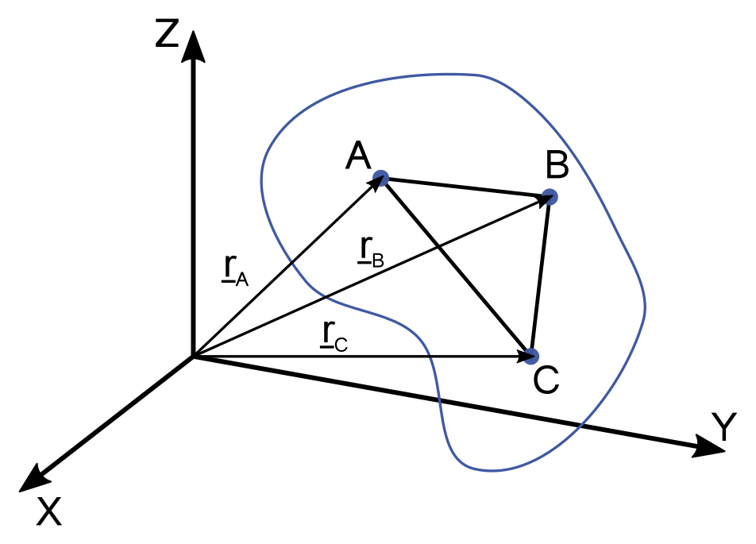
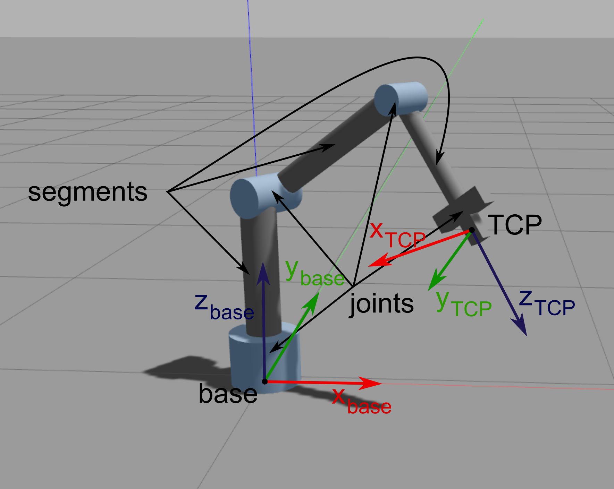
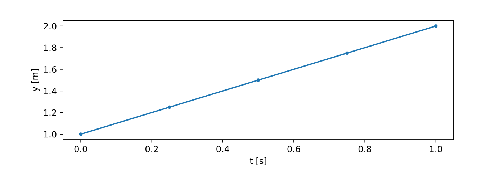

# 04. Robotikai alapfogalmak, da Vinci sebészrobot programozása szimulált környezetben

!!! warning
    **ZH1** (ROS alapok, publisher, subscriber. Python alapok. Robotikai alapfogalmak.) **március 28. 10:45, BA.1.10**


---

## Elmélet

---


### Merev test mozgása

---

{:style="width:200px" align=right}

!!! abstract "Def. Merev test"
    Merevnek tekinthető az a test, mely pontjainak távolsága mozgás során nem változik, vagyis bármely két pontjának távolsága időben állandó.


- Merev test alakja, térfogata szintén állandó.
- Merev test térbeli helyzete megadható bármely 3 nem egy egyenesbe eső pontjának helyzetével.

{:style="width:200px" align=right}

- A test **helyzetét** szemléletesebben megadhatjuk egy tetszőleges pontjának 3 koordinátájával (pozíció) és a test orientációjával.


- Merev testek mozgásai két elemi mozgásfajtából tevődnek össze: **haladó mozgás (transzláció)** és **tengely körüli forgás (rotáció)**


- **Transzlációs mozgás** során a test minden pontja egymással párhuzamos, egybevágó pályát ír le, a test orientációja pedig nem változik.

{:style="width:200px" align=right}

- **Rotáció**  során a forgástengelyen lévő pontok pozíciója nem változik, a test többi pontja pedig a forgástengelyre merőleges síkokban körpályán mozog.


- A **merev test szabad mozgása** is leírható mint egyidejűleg egy bizonyos **tengely körüli forgás és egy haladó mozgás**.

---

### 3D transzformációk

---


- **Pozíció:** 3 elemű offszet vektor 
{:style="width:250px" align=right}
- **Orientáció:** 3 x 3 rotációs matrix
    - további orientáció reprezentációk: Euler-szögek, RPY, angle axis, quaternion

- **Helyzet** (pose): 4 × 4 transzformációs mártrix
- **Koordináta rendszer** (frame): null pont, 3 tengely, 3 bázis vektor, jobbkéz-szabály
- **Homogén transzformációk:** rotáció és transzláció együtt
    - pl. $\mathbf{R}$ rotáció és $\mathbf{v}$ transzláció esetén:

$$
\mathbf{T} = \left[\matrix{\mathbf{R} & \mathbf{v}\\\mathbf{0} & 1 }\right] = \left[\matrix{r_{1,1} & r_{1,2} & r_{1,3} & v_x\\r_{2,1} & r_{2,2} & r_{2,3} & v_y\\r_{3,1} & r_{3,2} & r_{3,3} & v_z\\\ 0 & 0 & 0 & 1 }\right]
$$

- **Homogén koordináták:** 
    - **Vektor:** 0-val egészítjük ki, $\mathbf{a_H}=\left[\matrix{\mathbf{a} \\ 0}\right]=\left[\matrix{a_x \\ a_y \\ a_z \\ 0}\right]$
    - **Pont:** 1-gyel egészítjük ki, $\mathbf{p_H}=\left[\matrix{\mathbf{p} \\ 1}\right]=\left[\matrix{p_x \\ p_y \\ p_z \\ 1}\right]$
    - Transzformációk alkalmazása egyszerűbb:

$$
\mathbf{q} = \mathbf{R}\mathbf{p} + \mathbf{v} \to \left[\matrix{\mathbf{q} \\ 1}\right] = \left[\matrix{\mathbf{R} & \mathbf{v}\\\mathbf{0} & 1 }\right]\left[\matrix{\mathbf{p} \\ 1}\right]
$$

- **Szabadsági fok** (DoF): egymástól független mennyiségek száma.

---

### Robotikai alapok

---

{:style="width:400px" align=right}

- Robotok felépítése: **szegmensek** (segment, link) és **csuklók** (joints)
- **Munkatér** (task space, cartesian space):  
    - Háromdimenziós tér, ahol a feladat, trajektóriák, akadályok, stb. definiálásra kerülnek.
    - **TCP** (Tool Center Point): az end effektorhoz rögzített koordináta rendszer (frame)
    - **Base/world frame**
- **Csuklótér** (joint space):
    -  A robot csuklóihoz rendelt mennyiségek, melyeket a robot alacsony szintű irányító rendszere értelmezni képes.
    -  csukló koordináták, sebességek, gyorsulások, nyomatékok...


---

### Python libraries

---

#### Numpy

---

- Python library
- High dimension arrays and matrices
- Mathematical functions

```python
import numpy as np

# Creating ndarrays
a = np.zeros(3)
a.shape
a.shape=(3,1)
a = np.ones(5)
a = np.empty(10)
l = np.linspace(5, 10, 6)
r = np.array([1,2])    # ndarray from python list
r = np.array([[1,2],[3,4]])
type(r)

# Indexing
l[0]
l[0:2]
l[-1]
r[:,0]

# Operations on ndarrays
r_sin = np.sin(r)
np.max(r)
np.min(r)
np.sum(r)
np.mean(r)
np.std(r)

l < 7
l[l < 7]
np.where(l < 7)

p = np.linspace(1, 5, 6)
q = np.linspace(10, 14, 6)

s = p + q
s = p * q
s = p * 10
s = p + 10
s = p @ q    # dot product
s = r.T
```
If not installed:

```bash
pip3 install numpy
```

#### Matplotlib

- Visualization in python
- Syntax similar to Matlab

```python
import numpy as np
from matplotlib import pyplot as plt

X = np.linspace(-np.pi, np.pi, 24)
C, S = np.cos(X), np.sin(X)

plt.plot(X, C, label='y=cos(x)', marker='.')
plt.plot(X, S label='y=sin(x)', marker='.')

plt.xlabel('x')
plt.ylabel('y')
plt.legend()

plt.show()
```

If not installed:

```bash
pip3 install matplotlib
```


---

## Gyakorlat

---


<iframe width="560" height="315" src="https://www.youtube.com/embed/QksAVT0YMEo" title="YouTube video player" frameborder="0" allow="accelerometer; autoplay; clipboard-write; encrypted-media; gyroscope; picture-in-picture" allowfullscreen></iframe>


---

### 1: dVRK ROS 2 install

---

1. Telepítsük az alábbi dependency-ket:

    ```bash
    sudo apt install python3-vcstool python3-colcon-common-extensions python3-pykdl libxml2-dev libraw1394-dev libncurses5-dev qtcreator swig sox espeak cmake-curses-gui cmake-qt-gui git subversion gfortran libcppunit-dev libqt5xmlpatterns5-dev libbluetooth-dev libhidapi-dev python3-pyudev gfortran-9 ros-humble-joint-state-publisher* ros-humble-xacro
    ```


    ---

2. Klónozzuk a dVRK-t (da Vinci Reserach Kit) `vcs` segítségével egy új workspace-be, majd build-eljük:

    ```bash
    mkdir -p ~/dvrk2_ws/src
    cd ~/dvrk2_ws/src                
    vcs import --recursive --input https://raw.githubusercontent.com/jhu-dvrk/dvrk-github-workflow/main/vcs/ros2-dvrk-2.2.1.vcs
    cd ~/dvrk2_ws
    colcon build --cmake-args -DCMAKE_BUILD_TYPE=Release   
    source ~/dvrk2_ws/install/setup.bash
    ```

    ---
 
3. A `.bashrc` fájl végére illesszük be az alábbi sort:

    ```bash
    source ~/dvrk2_ws/install/setup.bash
    ```

    ---
    
4. Indítsuk el a PSM1 (Patient Side Manipulator) RViz szimulációját. A dVRK konzolon ne felejtsünk el HOME-olni. 
Tanulmányozzuk a szimulátor működését a tanult parancsok
(`ros2 topic list`, `ros2 topic echo` `ros2 run rqt_gui rqt_gui`, stb.) használatával. 


    ```bash
    # dVRK main console
    ros2 run dvrk_robot dvrk_console_json -j ~/dvrk2_ws/install/sawIntuitiveResearchKitAll/share/sawIntuitiveResearchKit/share/console/console-PSM1_KIN_SIMULATED.json
    ```

    ```bash
    # ROS 2 joint and robot state publishers
    ros2 launch dvrk_model dvrk_state_publisher.launch.py arm:=PSM1
    ```
   

    ```bash
    # RViz
    ros2 run rviz2 rviz2 -d ~/dvrk2_ws/install/dvrk_model/share/dvrk_model/rviz/PSM1.rviz
    ```


    ```bash
    # rqt_gui
    ros2 run rqt_gui rqt_gui
    ```

---

    
    

### 2: PSM subscriber implementálása

---

1. Hozzunk létre új python forrásfájlt `psm_grasp.py` névvel a  `~/ros2_ws/src/ros2_course/ros2_course` mappában. Adjuk meg az új entry point-ot a `setup.py`-ban a megszokott módon.

    ---
    
2. Iratkozzunk fel a PSM TCP (Tool Center Point) pozícióját és a csipesz pofái által bezárt szögét publikáló topic-okra.

    ```bash
    /PSM1/measured_cp
    /PSM1/jaw/measured_js
    ```
    
    ---

3. Build-eljünk és futtassuk a node-ot:

    ```bash
    cd ~/ros2_ws
    colcon build --symlink-install
    ros2 run ros2_course psm_grasp 
    ```

    ---

### 3. PSM TCP mozgatása lineáris trajektória mentén

---

{:style="width:350px" align=right}


1. A PSM a lenti topicok-ban várja a kívánt TCP pozíciót és a csipesz pofái által bezárt szöget. Hozzunk létre publishereket a `psm_grasp.py` fájlban ezekhez a topicokhoz.

    ```bash
    /PSM1/servo_cp
    /PSM1/jaw/servo_jp
    ```

    ---

2. Írjunk függvényt, amely lineáris trajektória mentén a kívánt pozícióba mozgatja a TCP-t. Küldjük az csipeszt a (0.0, 0.05, -0.12) pozícióba,
az orientációt hagyjuk változatlanul. 0.01s legyen a mintavételi idő. Matplotlib használatával plotoljuk a tervezett trajektória
x, y és z komponensét idő függvényében.

    ```python
    def move_tcp_to(self, target, v, dt):
    ```
   
    {:style="width:700px" align=right}
    
    ---

    
3. Írjunk függvényt, amellyel a csipeszt tudjuk nyitni-zárni, szintén lineáris trajektória használatával.


    ```python
    def move_jaw_to(self, target, omega, dt):
    ```
    

    ---
    
### 4. Dummy marker létrehozása

---

1. Hozzunk létre új python forrásfájlt `dummy_marker.py` névvel. Adjuk meg az entry point-ot a `setup.py`-ban a megszokott módon.
Implementájunk python programot, amely markert publikál (-0.05, 0.08, -0.14) pozícióval `dummy_target_marker` nevű topic-ban.
A `frame_id` addattag értéke legyen `PSM1_psm_base_link`. Másoljuk az alábbi kódot a `dummy_marker.py` fájlba:

    ```python
    import rclpy
    from rclpy.node import Node
    from visualization_msgs.msg import Marker
    
    class DummyMarker(Node):
        def __init__(self, position):
            super().__init__('minimal_publisher')
            self.position = position
            self.publisher_ = self.create_publisher(Marker, 'dummy_target_marker', 10)
            timer_period = 0.1  # seconds
            self.timer = self.create_timer(timer_period, self.timer_callback)
            self.i = 0
            i = 0
    
        def timer_callback(self):
            marker = Marker()
            marker.header.frame_id = 'PSM1_psm_base_link'
            marker.header.stamp = self.get_clock().now().to_msg()
            marker.ns = "dvrk_viz"
            marker.id = self.i
            marker.type = Marker.SPHERE
            marker.action = Marker.MODIFY
            marker.pose.position.x = self.position[0]
            marker.pose.position.y = self.position[1]
            marker.pose.position.z = self.position[2]
            marker.pose.orientation.x = 0.0
            marker.pose.orientation.y = 0.0
            marker.pose.orientation.z = 0.0
            marker.pose.orientation.w = 1.0
            marker.scale.x = 0.008
            marker.scale.y = 0.008
            marker.scale.z = 0.008
            marker.color.a = 1.0 # Don't forget to set the alpha!
            marker.color.r = 0.0
            marker.color.g = 1.0
            marker.color.b = 0.0;
    
            self.publisher_.publish(marker)
            self.i += 1
    
   
    def main(args=None):
        rclpy.init(args=args)
        marker_publisher = DummyMarker([-0.05, 0.08, -0.12])
        rclpy.spin(marker_publisher)
    
        # Destroy the node explicitly
        # (optional - otherwise it will be done automatically
        # when the garbage collector destroys the node object)
        marker_publisher.destroy_node()
        rclpy.shutdown()
    
    if __name__ == '__main__':
        main()
    ```

    ---

2. Futtassuk a node-ot és jelenítsük meg a markert RViz-ben.

    ---

### 5. Marker megfogása

---

1. Iratkozzunk fel a marker pozícióját küldő topic-ra a `psm_grasp.py`-ban.

    ---

2. Módosítsuk a `psm_grasp.py` programot úgy, hogy a csipesszel fogjuk meg a generált markert.

    !!! note
        A használt szimulátor hajlamos rá, hogy bizonyos értékek "beragadjanak", ezért a program elején érdemes az alábbi sorok használatával resetelni a kart:
        ```python
        #Reset the arm
        psm.move_tcp_to([0.0, 0.0, -0.12], 0.01, 0.01)
        psm.move_jaw_to(0.0, 0.1, 0.01)
        ```


---

### 6. TCP mozgatása körív mentén

---


1. Implementáljunk metódust, amely r sugrú körív mentén mozgatja a megfogót.


---

## Hasznos linkek

- [Download and compile dVRK 2](https://github.com/jhu-dvrk/sawIntuitiveResearchKit/wiki/BuildROS2)
- [Marker examples](https://www.programcreek.com/python/example/88812/visualization_msgs.msg.Marker)
- [Numpy vector magnitude](https://numpy.org/doc/stable/reference/generated/numpy.linalg.norm.html)
- [Numpy linspace](https://numpy.org/doc/stable/reference/generated/numpy.linspace.html)


