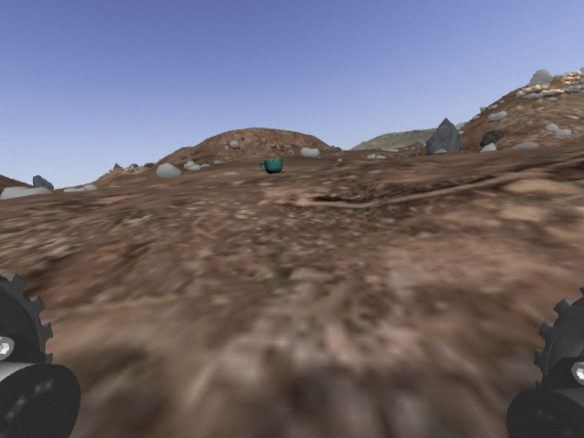

# 08. Szenzoros adatok gyűjtése és feldolgozása

---


## Gyakorlat

---

!!! note "Thing may change here..."
    Ezt a gyakorlatot lehet, hogy le fogjuk cserélni.


### 1: Leo rover

---

1. Installáljuk a Leo rover ROS package-eit:

    ```bash
    sudo apt update
    sudo apt install ros-noetic-leo*
    ```
    
    ---

2. A http://wiki.ros.org/leo_gazebo leírás segítségével indítsuk el a gazebo szimulátort a Mars landscape-pel.

    ---
    
3. Indítsunk teleop node-ot, és mozgassuk meg a robotot.

    ---

### 2: Kávé a Marson -- képek rögzítése

---

!!! warning
    A Mars rover képet küldött egy különös, kávés bögrének tűnő tárgyról! A feladat, hogy fordítsuk a rovert a bögre felé, majd közelítsük meg, hogy részletesen megvizsgálhassuk.


{:style="width:600px"}

---

1. Indítsuk el a Gazebo-t:

    ```bash
        gazebo
    ```
    
    ---
    
2. Az `insert` panelen keressük ki a `googleresearch/models/cole_hardware_mug_classic_blue` modellt, majd helyezzük el a szimulációban. Ez azért kell, hogy később meglegyen a bögre modellje a fáljrendszerünkben.

    ---
    
3. Zárjuk be a Gazebo-t

    
    ---
   
4. Töltsük le a `leo_masryard_coffee.launch` és a `marsyard_coffe.world` fájlokat, majd másoljuk be rendre a `catkin_ws/src/ros_course/launch` és `catkin_ws/src/ros_course/worlds` mappákba.

    ---

5. A `.world` fájlokban írjuk át a `/home/tamas/.ignition/fuel/fuel...` elérési utakat (fájlonként 2x) a sajátunkra.

    ---
    
6. Indítsuk el a szimulátort:

    ```bash
        roslaunch ros_course leo_marsyard_coffee.launch
    ```
    
    ---
    
3. Indítsuk el a teleopot és az `rqt_image_view`-t:

    ```bash
        rosrun leo_teleop key_teleop
        ```
        
    ```bash
        rosrun rqt_image_view rqt_image_view
    ```

    !!! tip
        Ha a szimulátor futtatása túlságosan megterhelő a PC számára, dolgozhatunk a terrain nélküli `leo_gazebo_coffee.launch` és `gazebo_coffe.world` fájlokkal is.

    ---

4. Mentsünk le egy-egy képet, amin látható, illetve nem látható a kávés bögre. 

    ---
    
### 3: Kávé a Marson -- offline képfeldolgozás

---

1. Írjunk Python szkriptet, amely beolvassa és megjeleníti a lementett képeket.

    ---
    
2. Szín alapú szegmentálással (vagy bárhogy máshogy) szegmentáljuk a kávés bögrét.

    ---

3. Határozzuk meg a bögre középpontját képi koordinátákban.

    ---
    
4. A szegmentálás zaja gondot okozhat, próbáljuk meg leszűrni.

    ---

### 4: Kávé a Marson -- online perception node

---

1. Iratkozzunk fel a `/camera/image_raw` topicra, majd a `cv.imshow()` függvény segítségéval jelenítsük meg a kapott képeket.

    ---
    
2. Dolgozzuk be a működő computer vision algoritmusunkat egy ROS node-ba.

    ---
    
3. Publikáljuk új topicban a detektált bögre középpontjának képi koordinátát. Használhatjuk pl. az Int32MultiArray, Point2D típusokat, vagy definiálhatunk sajátot (később szükség lesz a bögre méretére is).

    ---
    
4. *Bónusz: publikáljuk a maszkot és a maszkolt képet egy-egy Image topicban*

    ---
    
### 5: Kávé a Marson -- operation logic node

---
    
1. Írjunk új ROS node-ot, amely fogadja a perception node üzeneteit, illetve képes a rover mozgásának irányítására.

    ---

2. Forgassuk a rovert egy helyben, amíg a bögre a kép közepére nem kerül.

    ---
    
3. Közelítsük meg a bögrét annyira, hogy a látszólagos mérete a kép méretének 50%-át el nem éri.

    ---

4. Mentsünk le képet a gyanús objektumról.

    ---

### 5+1: Bónusz

---

1. Nézzünk szét Gazebo-ban a beilleszthető modellek között (`insert` panel) és válasszunk egyet, amely valamilyen más módszerrel detektálható a kamera képén (pl. template matching).

    ---
    
2. Módosítsuk úgy a node-okat, hogy ezt az objektumot közelítse meg a rover.

    ---

    !!! warning "Figyelem!"
        Az óra végén a forráskódokat mindenkinek fel kell tölteni Moodle-re egy zip archívumba csomagolva!


---

## Hasznos linkek

- [http://wiki.ros.org/leo_gazebo]()
- [http://wiki.ros.org/cv_bridge/Tutorials/ConvertingBetweenROSImagesAndOpenCVImagesPython]()
- [https://realpython.com/python-opencv-color-spaces/]()
- [https://stackoverflow.com/questions/59164192/how-to-find-the-contour-of-a-blob-using-opencv-python]()


