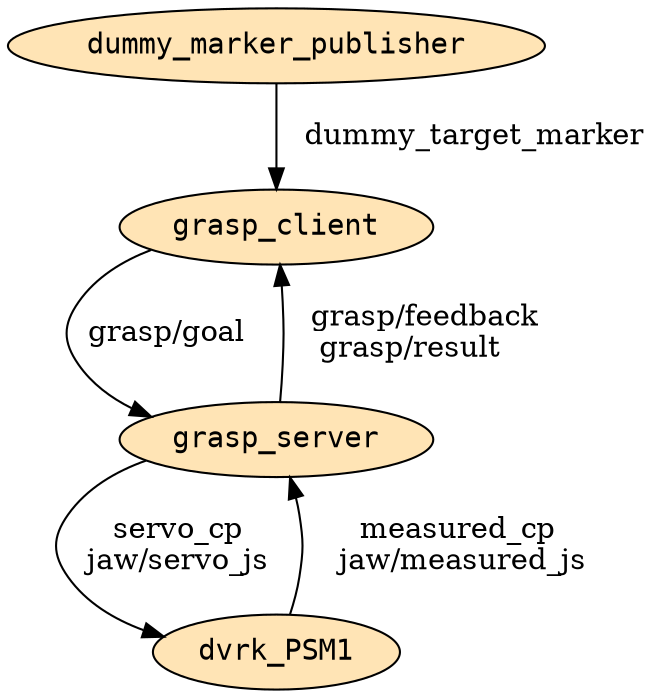

# 08. ROS Action, ROS Service

---

## Elmélet

--- 

!!! warning
	**ZH2** **május 26.**


### ROS Service

- Request/reply communication
- Use a client-server model
- Similar to Remote Procedure Calls (RPC)
- Blocking behavior by default (can be async)
- Command line tools: `rossrv`, `rosservice`

#### ROS `.srv` files


```bash
int a
int b
---
int sum
```

```bash
#request constants
int8 FOO=1
int8 BAR=2
#request fields
int8 foobar
another_pkg/AnotherMessage msg
---
#response constants
uint32 SECRET=123456
#response fields
another_pkg/YetAnotherMessage val
CustomMessageDefinedInThisPackage value
uint32 an_integer
```

---

### ROS Action

{:style="width:800px"}

<!--suppress XmlDeprecatedElement -->
<font size="1"> Image source: https://docs.ros.org/ </font>

- Ideal for communication with slower processes, e.g. environmental inetarcion
- Asynchronous communication (non-blocking)
- Actions consist of a goal, feedback, and a result
- Built on topics and services and function similarly to services
- Actions are preemptable, (can be canceled while executing)
- Provide steady feedback, unlike services which return a single response
- Actions use a client-server model, similar to the publisher-subscriber model
- An *action client* node sends a goal to an *action server* node that acknowledges the goal and returns a stream of feedback and a result.


#### ROS `.action` files

```bash
# Define the goal
uint32 dishwasher_id  # Specify which dishwasher we want to use
---
# Define the result
uint32 total_dishes_cleaned
---
# Define a feedback message
float32 percent_complete
```

---

### Building custom interfaces (`.msg` , `.srv` and `.action` files)

- `CMakeList.txt` and `package.xml` need to be modified
- For messages and services, see [https://docs.ros.org/en/foxy/Tutorials/Beginner-Client-Libraries/Custom-ROS2-Interfaces.html](https://docs.ros.org/en/foxy/Tutorials/Beginner-Client-Libraries/Custom-ROS2-Interfaces.html)
- For actions, see [https://docs.ros.org/en/foxy/Tutorials/Intermediate/Creating-an-Action.html](https://docs.ros.org/en/foxy/Tutorials/Intermediate/Creating-an-Action.html)


---


## Gyakorlat

---

### 1: Actions with Turtlesim

---

1. Indítsunk el egy `turtlesim node`-ot és egy `turtle_teleop_key`-t.
Figyeljük megy a `G|B|V|C|D|E|R|T` billentyűk lenyomásának hatását.


    ```bash
    ros2 run turtlesim turtlesim_node
    ```

    ```bash
    ros2 run turtlesim turtle_teleop_key
    ```

    ---

2. Tanulmányozzuk a rendszer működését az alábbi parancsok segítségével:

    ```bash
    ros2 node info /turtlesim
    ros2 node info /teleop_turtle
    ros2 action list -t
    ros2 action info /turtle1/rotate_absolute
    ros2 interface show turtlesim/action/RotateAbsolute
    ```

    ---

3. Küldjünk action goal-t a parancssorból:


    ```bash
    ros2 action send_goal /turtle1/rotate_absolute turtlesim/action/RotateAbsolute "{theta: 3.14}"
    ```

---

### 2: PSM grasp action

A következőkben ROS action server--client architektúrát fogunk implementálni.
A korábban implementált `psm_grasp.py` funkcionalitását fogjuk két külön node-ra
bontani az alább ábra szerint.



---

#### 2.1: dVRK ROS2 install

---

{:style="width:350px" align=right}


1. Ubuntu 20.04-en az alábbi csomagokra lesz sükség:


    ```bash
    sudo apt install python3-vcstool python3-colcon-common-extensions python3-pykdl libxml2-dev libraw1394-dev libncurses5-dev qtcreator swig sox espeak cmake-curses-gui cmake-qt-gui git subversion gfortran libcppunit-dev libqt5xmlpatterns5-dev libbluetooth-dev ros-foxy-joint-state-publisher* ros-foxy-xacro
    ```


    ---


2. Clone-ozzuk a dVRK ROS2 csomagokat  `vcs`-sel, majd build-eljük:


    ```bash
    cd ~/ros2_ws/src                
    vcs import --input https://raw.githubusercontent.com/jhu-dvrk/dvrk_robot_ros2/main/dvrk.vcs --recursive
    colcon build --symlink-install --cmake-args -DCMAKE_BUILD_TYPE=Release   
    source ~/ros2_ws/install/setup.bash
    ```
    

    ---
    
3. Indítsuk el a PSM1 RViz szimulációját. A dVRK konzolon ne felejtsünk el HOME-olni.


    ```bash
    # dVRK main console
    ros2 run dvrk_robot dvrk_console_json -j ~/ros2_ws/install/sawIntuitiveResearchKitAll/share/sawIntuitiveResearchKit/share/console/console-PSM1_KIN_SIMULATED.json
    ```

    ```bash
    # ROS 2 joint and robot state publishers
    ros2 launch dvrk_model dvrk_state_publisher.launch.py arm:=PSM1
    ```

    ```bash
    # RViz
    ros2 run rviz2 rviz2 -d ~/ros2_ws/install/dvrk_model/share/dvrk_model/rviz/PSM1.rviz
    ```

    !!! tip "URDF-fel kapcsolatos hibák esetén"
        ```bash
        CLion-ban az interpreterhez adjuk hozzá a
        locale  # check for UTF-8

        sudo apt update && sudo apt install locales
        sudo locale-gen en_US en_US.UTF-8
        sudo update-locale LC_ALL=en_US.UTF-8 LANG=en_US.UTF-8
        export LANG=en_US.UTF-8

        locale  # verify settings
        ```

    ---

4. Tanulmányozzuk a szimulátor működését ROS 2-ből a tanult prancsok
(`ros2 topic list`, `ros2 topic echo` `ros2 run rqt_gui rqt_gui`, stb.) használatával. 


---

### 2.2: Grasp action létrehozása

---

1. Hozzunk létre új csomagot `ros2_course_msgs` névvel:

    ```bash
    cd ros2_ws/src
    ros2 pkg create --build-type ament_cmake ros2_course_msgs --dependencies action_msgs std_msgs geometry_msgs rosidl_default_generators
    ```

    ---

2. Hozzuk létre a `ros2_course_msgs/action/Grasp.action` fájlt az alábbi tartalommal:


    ```bash
    # Goal
    geometry_msgs/Point grasp_pos
    ---
    # Result
    bool success
    ---
    # Feedback
    string status
    ```

    ---

3. Adjuk hozzá a következőt a `CMakeLists.txt`-hez:

    ```cmake
    rosidl_generate_interfaces(${PROJECT_NAME}
        "action/Grasp.action"
        DEPENDENCIES geometry_msgs
    )
    ```
   
    ---
   
4. Adjuk hozzá a dependency-ket a `package.xml`-hez:

    ```xml
    <buildtool_depend>rosidl_default_generators</buildtool_depend>

    <member_of_group>rosidl_interface_packages</member_of_group>
    ```

    ---

5. Build-eljük a workspace-t:

    ```bash
    cd ~/ros2_ws
    colcon build --symlink-install --cmake-args -DCMAKE_BUILD_TYPE=Release
    ```

    ---

6. Ellenőrizzük, hogy létrejött-e a `Grasp` action:

    ```bash
    source ~/ros2_ws/install/setup.bash
    ros2 interface show ros2_course_msgs/action/Grasp
    ```
7. A `ros2_course` csomag `package.xml`-jéhez adjuk hozzá a következő sort
a `ros2_course_msgs`dependency beállításához:

    ```xml
    <exec_depend>ros2_course_msgs</exec_depend>
    ```

---

### 2.2: Grasp server implementálása

---

1. Hozzunk létre új python forrásfájlt `grasp_server.py` névvel a 
`~/ros2_ws/src/ros2_course/ros2_course` mappában. Adjuk meg az új entry point-ot a
`setup.py`-ban a megszokott módon.

    ---
    
2. Implementáljuk az action server-t. Induljunk ki a példából:
[https://docs.ros.org/en/foxy/Tutorials/Intermediate/Writing-an-Action-Server-Client/Py.html](https://docs.ros.org/en/foxy/Tutorials/Intermediate/Writing-an-Action-Server-Client/Py.html).
A node funkcionalitása átemelhető a `psm_grasp.py`-ból. A node egy `Grasp` action-t vár, melynek hatására
megragadja a goal-ban szerepló koordinátákon található tárgyat (a dummy markert).


    !!! tip "CLion interpreter"
        CLion-ban az interpreterhez adjuk hozzá a
        `/home/tamas/ros2_ws/install/ros2_course_msgs/lib/python3.8/site-packages` elérési utat.


    !!! warning "measured_cp és servo_cp topic-ok dVRK ROS 2-ben"
        DVRK ROS 2-ben változott a topic-ok típusa: `geometry_msgs/msg/PoseStamped`.


    ---

3. Futtassuk az action client-et (`grasp_client`) és a `dummy_marker`-t:


    ```bash
    ros2 run ros2_course dummy_marker
    ```

    ```bash
    ros2 run ros2_course grasp_client
    ```

---

### 2.3: Grasp client implementálása

---

1. Hozzunk létre új python forrásfájlt `grasp_client.py` névvel a
`~/ros2_ws/src/ros2_course/ros2_course` mappában. Adjuk meg az új entry point-ot a
`setup.py`-ban a megszokott módon.

    ---

2. Implementáljuk az action client-et. Induljunk ki a példából:
[https://docs.ros.org/en/foxy/Tutorials/Intermediate/Writing-an-Action-Server-Client/Py.html](https://docs.ros.org/en/foxy/Tutorials/Intermediate/Writing-an-Action-Server-Client/Py.html).
A node funkcionalitása átemelhető a `psm_grasp.py`-ból. A node feliratkozik a `/dummy_target_marker`
topic-ra, és egy `Grasp` action request-et küld az action server-nek (`grasp_server') a marker
megragadására.

    ---

3. Futtassuk az action server-t és teszteljük a működését parancssorból:


    ```bash
    ros2 run ros2_course grasp_server
    ```

    ```bash
    ros2 node info grasp_server
    ros2 action list -t
    ros2 action info /grasp
    ros2 interface show ros2_course_msgs/action/Grasp
    ros2 action send_goal --feedback /grasp ros2_course_msgs/action/Grasp "{grasp_pos: {x: 0.0, y: 0.0, z: -0.18}}"
    ```

---
    
### 3. IsPrime service

---

1. Implementáljunk ROS Service-t, amely egy kapott természetes számról megállapítja, prím-e. Használjuk az implementált service-t.
Kiindulhatunk ebből a példából: [https://docs.ros.org/en/foxy/Tutorials/Beginner-Client-Libraries/Writing-A-Simple-Py-Service-And-Client.html](https://docs.ros.org/en/foxy/Tutorials/Beginner-Client-Libraries/Writing-A-Simple-Py-Service-And-Client.html).
  

---

## Hasznos linkek

- [Build dVRK2 on ROS2](https://github.com/jhu-dvrk/sawIntuitiveResearchKit/wiki/BuildROS2)
- [ROS 2 examples](https://github.com/ros2/examples)
- [Understanding ROS actions](https://docs.ros.org/en/foxy/Tutorials/Beginner-CLI-Tools/Understanding-ROS2-Actions/Understanding-ROS2-Actions.html)
- [Creating an action](https://docs.ros.org/en/foxy/Tutorials/Intermediate/Creating-an-Action.html)
- [Writing an Action Server and Client](https://docs.ros.org/en/foxy/Tutorials/Intermediate/Writing-an-Action-Server-Client/Py.html)
- [https://docs.ros.org/en/foxy/Tutorials/Beginner-Client-Libraries/Writing-A-Simple-Py-Service-And-Client.html](https://docs.ros.org/en/foxy/Tutorials/Beginner-Client-Libraries/Writing-A-Simple-Py-Service-And-Client.html)


